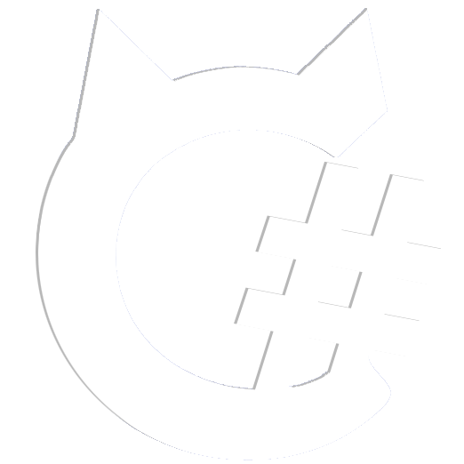

<p align="center">
  
</p>

<h1 align="center" style="border-bottom: none;">CivitaiSharp</h1>

<p align="center">
  Civitai.comのための、モダンで軽量、AOT対応の.NET 10クライアントライブラリ
</p>

<p align="center">
  <!-- Status -->
  
  <!-- License -->
  <a href="https://opensource.org/licenses/MIT">
    
  </a>
  <!-- .NET -->
  <a href="https://dotnet.microsoft.com/">
    
  </a>
  <!-- GitHub -->
  <a href="https://github.com/Mewyk/CivitaiSharp">
    
  </a>
  <!-- NuGet -->
  <a href="https://www.nuget.org/packages/CivitaiSharp.Core">
    
  </a>
</p>

<p align="center">
  <a href="README.md">English</a> |
  <a href="README.es-AR.md">Espanol (Argentina)</a> |
  <strong>日本語</strong>
</p>

<p align="center">
<strong>
  CivitaiSharpは現在Alpha版です。API、機能、安定性は変更される可能性があります。
</strong>
</p>

## 目次
1. [パッケージとリリーススケジュール](#1-パッケージとリリーススケジュール)
2. [インストール](#2-インストール)
3. [クイックスタート](#3-クイックスタート)
4. [設定](#4-設定)
5. [APIの例](#5-apiの例)
6. [機能](#6-機能)
7. [ドキュメント](#7-ドキュメント)
8. [既知のAPI特性](#8-既知のapi特性)
9. [バージョニング](#9-バージョニング)
10. [ライセンス](#10-ライセンス)
11. [コントリビューション](#11-コントリビューション)

---

## 1. パッケージとリリーススケジュール
| パッケージ | ステータス | 説明 |
|-----------|-----------|------|
| **CivitaiSharp.Core** | Alpha | モデル、画像、タグ、クリエイター用のパブリックAPIクライアント |
| **CivitaiSharp.Sdk** | Alpha | 画像生成ジョブ用のGenerator/Orchestration APIクライアント |
| **CivitaiSharp.Tools** | Alpha | ダウンロード、ファイルハッシュ、HTML解析用のユーティリティ |

> **注意:** すべてのパッケージは現在Alpha版です。マイナーバージョン間でAPIが変更される可能性があります。

> **警告:** CivitaiSharp.Sdkは完全にテストされておらず、本番環境での使用は推奨されません。自己責任でご使用ください。

---

## 2. インストール
NuGet経由でインストール:

```shell
# Coreライブラリ - モデル、画像、タグ、クリエイター用のAPIクライアント
dotnet add package CivitaiSharp.Core --prerelease

# SDK - 画像生成とジョブ管理（APIトークンが必要）
dotnet add package CivitaiSharp.Sdk --prerelease

# Tools - ファイルハッシュ、ダウンロード、HTML解析
dotnet add package CivitaiSharp.Tools --prerelease
```

---

## 3. クイックスタート
### 最小限の例
CivitaiSharp.Coreを始める最も簡単な方法:

```csharp
using CivitaiSharp.Core;
using CivitaiSharp.Core.Extensions;
using Microsoft.Extensions.DependencyInjection;

var services = new ServiceCollection();
services.AddCivitaiApi();

await using var provider = services.BuildServiceProvider();
var client = provider.GetRequiredService<IApiClient>();

var result = await client.Models.ExecuteAsync();
if (result.IsSuccess)
{
    foreach (var model in result.Value.Items)
        Console.WriteLine(model.Name);
}
```

### 設定付きの完全な例

```csharp
using CivitaiSharp.Core;
using CivitaiSharp.Core.Extensions;
using CivitaiSharp.Core.Models;
using Microsoft.Extensions.DependencyInjection;

var services = new ServiceCollection();
services.AddCivitaiApi(options =>
{
    options.TimeoutSeconds = 120;
    options.StrictJsonParsing = true;
});

await using var provider = services.BuildServiceProvider();
var client = provider.GetRequiredService<IApiClient>();

var result = await client.Models
    .WhereType(ModelType.Checkpoint)
    .WhereNsfw(false)
    .OrderBy(ModelSort.MostDownloaded)
    .ExecuteAsync(resultsLimit: 10);

if (result.IsSuccess)
{
    foreach (var model in result.Value.Items)
        Console.WriteLine($"{model.Name} by {model.Creator?.Username}");
}
else
{
    Console.WriteLine($"エラー: {result.ErrorInfo.Message}");
}
```

---

## 4. 設定
### appsettings.jsonの使用
CivitaiSharp.Coreはデフォルトで`CivitaiApi`セクションから設定を読み込みます。

<details>
<summary><strong>最小設定（appsettings.json）</strong></summary>

```json
{
  "CivitaiApi": {
  }
}
```

すべての設定には適切なデフォルト値があるため、空のセクションでも有効です。

</details>

<details>
<summary><strong>完全な設定（appsettings.json）</strong></summary>

```json
{
  "CivitaiApi": {
    "BaseUrl": "https://civitai.com",
    "ApiVersion": "v1",
    "ApiKey": null,
    "TimeoutSeconds": 30,
    "StrictJsonParsing": false
  }
}
```

| プロパティ | 型 | デフォルト | 説明 |
|-----------|-----|-----------|------|
| `BaseUrl` | `string` | `https://civitai.com` | Civitai APIのベースURL |
| `ApiVersion` | `string` | `v1` | APIバージョンのパスセグメント |
| `ApiKey` | `string?` | `null` | 認証リクエスト用のオプションAPIキー |
| `TimeoutSeconds` | `int` | `30` | HTTPリクエストのタイムアウト（1-300秒） |
| `StrictJsonParsing` | `bool` | `false` | マップされていないJSONプロパティで例外をスロー |

> **認証について:** Coreライブラリは、APIキーなしで公開エンドポイント（モデル、画像、タグ、クリエイター）をクエリできます。APIキーが必要なのは、お気に入り、非公開モデル、NSFWコンテンツ、より高いレート制限などの認証機能のみです。これはCivitaiSharp.Sdkとは異なり、**すべての操作でAPIトークンが必須**です。

</details>

<details>
<summary><strong>IConfigurationでの設定</strong></summary>

```csharp
using CivitaiSharp.Core.Extensions;
using Microsoft.Extensions.Configuration;
using Microsoft.Extensions.DependencyInjection;

var configuration = new ConfigurationBuilder()
    .AddJsonFile("appsettings.json")
    .Build();

var services = new ServiceCollection();
services.AddCivitaiApi(configuration);
// またはカスタムセクション名で:
// services.AddCivitaiApi(configuration, "MyCustomSection");

await using var provider = services.BuildServiceProvider();
```

</details>

---

## 5. APIの例
CivitaiSharp.Coreは各エンドポイントにフルエントビルダーを提供します。各ビルダーは不変でスレッドセーフです。

<details>
<summary><strong>モデルエンドポイント</strong></summary>

```csharp
// すべてのモデルを取得（デフォルトクエリ）
var result = await client.Models.ExecuteAsync();

// IDで特定のモデルを取得
var result = await client.Models.GetByIdAsync(12345);
if (result.IsSuccess)
    Console.WriteLine($"モデル: {result.Value.Name}");

// 最初に一致するモデルを取得（効率的な単一アイテム取得）
var result = await client.Models
    .WhereName("SDXL")
    .FirstOrDefaultAsync();
if (result is { IsSuccess: true, Value: not null })
    Console.WriteLine($"見つかりました: {result.Value.Name}");

// 名前で検索
var result = await client.Models
    .WhereName("SDXL")
    .ExecuteAsync();

// タイプでフィルタリングしてソート
var result = await client.Models
    .WhereType(ModelType.Checkpoint)
    .OrderBy(ModelSort.MostDownloaded)
    .ExecuteAsync(resultsLimit: 25);

// タグでフィルタリング
var result = await client.Models
    .WhereTag("anime")
    .WhereNsfw(false)
    .ExecuteAsync();

// クリエイターでフィルタリング
var result = await client.Models
    .WhereUsername("Mewyk")
    .OrderBy(ModelSort.Newest)
    .ExecuteAsync();

// ベースモデルでフィルタリング（文字列値、例: "SDXL 1.0", "SD 1.5", "Flux.1 D"）
var result = await client.Models
    .WhereBaseModel("SDXL 1.0")
    .WhereType(ModelType.Lora)
    .ExecuteAsync();

// 複数のベースモデルでフィルタリング
var result = await client.Models
    .WhereBaseModels("SDXL 1.0", "Pony")
    .ExecuteAsync();

// 特定のモデルIDでフィルタリング（クエリも提供されている場合は無視される）
var result = await client.Models
    .WhereIds(12345, 67890, 11111)
    .ExecuteAsync();

// バージョンIDで特定のモデルバージョンを取得
var versionResult = await client.Models.GetByVersionIdAsync(130072);
if (versionResult.IsSuccess)
{
    Console.WriteLine($"バージョン: {versionResult.Value.Name}");
    Console.WriteLine($"AIR: {versionResult.Value.AirIdentifier}");
}

// ファイルハッシュでモデルバージョンを取得（SHA256、AutoV2、CRC32など）
var hashResult = await client.Models.GetByVersionHashAsync("ABC123DEF456");
if (hashResult.IsSuccess)
{
    Console.WriteLine($"見つかりました: {hashResult.Value.Model?.Name}");
    Console.WriteLine($"AIR: {hashResult.Value.AirIdentifier}");
}
```

</details>

<details>
<summary><strong>画像エンドポイント</strong></summary>

```csharp
// すべての画像を取得（デフォルトクエリ）
var result = await client.Images.ExecuteAsync();

// 最初に一致する画像を取得
var result = await client.Images
    .WhereModelId(12345)
    .FirstOrDefaultAsync();
if (result is { IsSuccess: true, Value: not null })
    Console.WriteLine($"画像URL: {result.Value.Url}");

// モデルIDでフィルタリング
var result = await client.Images
    .WhereModelId(12345)
    .ExecuteAsync();

// モデルバージョンIDでフィルタリング
var result = await client.Images
    .WhereModelVersionId(67890)
    .OrderBy(ImageSort.Newest)
    .ExecuteAsync();

// ユーザー名でフィルタリング
var result = await client.Images
    .WhereUsername("Mewyk")
    .WhereNsfwLevel(ImageNsfwLevel.None)
    .ExecuteAsync(resultsLimit: 50);

// 投稿IDでフィルタリング
var result = await client.Images
    .WherePostId(11111)
    .ExecuteAsync();
```

</details>

<details>
<summary><strong>タグエンドポイント</strong></summary>

```csharp
// すべてのタグを取得（デフォルトクエリ）
var result = await client.Tags.ExecuteAsync();

// 名前でタグを検索
var result = await client.Tags
    .WhereName("portrait")
    .ExecuteAsync(resultsLimit: 100);
```

</details>

<details>
<summary><strong>クリエイターエンドポイント</strong></summary>

```csharp
// すべてのクリエイターを取得（デフォルトクエリ）
var result = await client.Creators.ExecuteAsync();

// 名前でクリエイターを検索
var result = await client.Creators
    .WhereName("Mewyk")
    .ExecuteAsync(resultsLimit: 20);

// ページベースのページネーション（モデル、タグ、クリエイターはカーソルではなくページを使用します）
var result = await client.Creators
    .WithPageIndex(2)
    .ExecuteAsync(resultsLimit: 50);
```

</details>

<details>
<summary><strong>ページネーション</strong></summary>

```csharp
// カーソルベースのページネーション（画像のみ）
string? cursor = null;
var allImages = new List<Image>();

do
{
    result = await client.Images
        .WhereModelId(12345)
        .ExecuteAsync(resultsLimit: 100, cursor: cursor);

    if (!result.IsSuccess)
        break;

    allImages.AddRange(result.Value.Items);
    cursor = result.Value.Metadata?.NextCursor;
    
} while (cursor is not null);

// ページベースのページネーション（モデル、タグ、クリエイター）
var page1 = await client.Models.WithPageIndex(1).ExecuteAsync();
var page2 = await client.Tags.WithPageIndex(2).ExecuteAsync();
var page3 = await client.Creators.WithPageIndex(3).ExecuteAsync();
```

</details>

<details>
<summary><strong>Tools - ファイルハッシュ</strong></summary>

```csharp
using CivitaiSharp.Tools.Hashing;
using CivitaiSharp.Tools.Extensions;
using Microsoft.Extensions.DependencyInjection;

var services = new ServiceCollection();
services.AddCivitaiDownloads();

await using var provider = services.BuildServiceProvider();
var hashingService = provider.GetRequiredService<IFileHashingService>();

// SHA256ハッシュを計算
var result = await hashingService.ComputeHashAsync(
    @"C:\Models\model.safetensors",
    HashAlgorithm.Sha256);

if (result.IsSuccess)
{
    Console.WriteLine($"ハッシュ: {result.Value.Hash}");
    Console.WriteLine($"サイズ: {result.Value.FileSize:N0} バイト");
}

// サポートされているアルゴリズム: Sha256, Sha512, Blake3, Crc32
var blake3Result = await hashingService.ComputeHashAsync(filePath, HashAlgorithm.Blake3);
```

</details>

<details>
<summary><strong>Tools - ファイルダウンロード</strong></summary>

```csharp
using CivitaiSharp.Core;
using CivitaiSharp.Core.Extensions;
using CivitaiSharp.Tools.Downloads;
using CivitaiSharp.Tools.Extensions;
using Microsoft.Extensions.DependencyInjection;

var services = new ServiceCollection();
services.AddCivitaiApi();
services.AddCivitaiDownloads(options =>
{
    options.Images.BaseDirectory = @"C:\Downloads\Images";
    options.Images.PathPattern = "{Username}/{Id}.{Extension}";
    
    options.Models.BaseDirectory = @"C:\Models";
    options.Models.PathPattern = "{ModelType}/{ModelName}/{FileName}";
    options.Models.VerifyHash = true;
});

await using var provider = services.BuildServiceProvider();
var apiClient = provider.GetRequiredService<IApiClient>();
var downloadService = provider.GetRequiredService<IDownloadService>();

// ハッシュ検証付きでモデルファイルをダウンロード
var modelResult = await apiClient.Models.GetByIdAsync(4201);
if (modelResult.IsSuccess)
{
    var version = modelResult.Value.ModelVersions?.FirstOrDefault();
    var file = version?.Files?.FirstOrDefault(f => f.Primary == true);
    
    if (file is not null && version is not null)
    {
        var downloadResult = await downloadService.DownloadAsync(file, version);
        if (downloadResult.IsSuccess)
        {
            Console.WriteLine($"ダウンロード完了: {downloadResult.Value.FilePath}");
            Console.WriteLine($"検証済み: {downloadResult.Value.IsVerified}");
        }
    }
}
```

</details>

<details>
<summary><strong>Tools - HTML解析</strong></summary>

```csharp
using CivitaiSharp.Tools.Parsing;

// HTML説明をMarkdownに変換
var markdown = HtmlParser.ToMarkdown(model.Description);

// プレーンテキストに変換
var plainText = HtmlParser.ToPlainText(model.Description);

// またはModel/ModelVersionの拡張メソッドを使用
var markdown = model.GetDescriptionAsMarkdown();
var plainText = modelVersion.GetDescriptionAsPlainText();
```

</details>

<details>
<summary><strong>エラーハンドリング</strong></summary>

```csharp
var result = await client.Models.ExecuteAsync();

// パターンマッチング
var message = result switch
{
    { IsSuccess: true, Value: var page } => $"{page.Items.Count}個のモデルが見つかりました",
    { IsSuccess: false, ErrorInfo: var error } => error.Code switch
    {
        ErrorCode.RateLimited => "リクエストが多すぎます。速度を落としてください",
        ErrorCode.Unauthorized => "無効または欠落したAPIキー",
        ErrorCode.NotFound => "リソースが見つかりません",
        _ => $"エラー: {error.Code} - {error.Message}"
    }
};

// 従来のアプローチ
if (result.IsSuccess)
{
    foreach (var model in result.Value.Items)
        Console.WriteLine(model.Name);
}
else
{
    Console.WriteLine($"失敗: {result.ErrorInfo.Message}");
}
```

</details>

---

## 6. 機能
- **モダンな.NET 10** - null許容参照型、record、プライマリコンストラクタで構築
- **フルエントクエリビルダー** - APIリクエストを構築するための型安全で不変のビルダー
- **Resultパターン** - 判別共用体による明示的な成功/失敗のハンドリング
- **組み込みのレジリエンス** - リトライポリシー、サーキットブレーカー、レート制限、タイムアウト
- **依存性注入** - `IHttpClientFactory`とMicrosoft DIのファーストクラスサポート
- **ストリーミングダウンロード** - `ResponseHeadersRead`によるメモリ効率の良いレスポンスハンドリング
- **明示的なJSONコントラクト** - すべてのモデルプロパティが型安全性のために`[JsonPropertyName]`を使用

---

## 7. ドキュメント
- [APIリファレンス](https://CivitaiSharp.Mewyk.com/Docs/api/)
- [はじめにガイド](https://CivitaiSharp.Mewyk.com/Guides/introduction.html)

---

## 8. 既知のAPI特性
CivitaiSharpはCivitai.com APIと連携しますが、いくつかの既知の特性があります。一部は自動的に軽減され、その他は文書化され調査中です。

| 問題 | 説明 |
|-----|------|
| タグエンドポイントのモデル数 | 文書化された機能ですが、レスポンスにこのフィールドは含まれていません |
| `limit=0`パラメータ | 様々なエンドポイントですべての結果を返すと文書化されていますが、エラーを返します |
| HTTP 200での意味的エラー | エラー、Not Foundなど、すべてHTTP 200を返します |
| エンドポイントの不整合 | 断続的なスロットリング、報告されていない障害、文書化されていないレート制限 |
| 可変メタデータ構造 | メタデータ形式はレスポンス間で大きく異なります |
| ユーザー存在の問題 | 部分的な障害中、既存のユーザーが存在しないように見えることがあります |
| **クリエイターエンドポイントの信頼性問題** | 以下の詳細を参照 |

### クリエイターエンドポイントの信頼性問題

`/api/v1/creators`エンドポイントは断続的な信頼性の問題が発生することが知られています:

- **HTTP 500エラー**: エンドポイントは特に負荷時にサーバーエラーを頻繁に返します
- **遅い応答時間**: リクエストは他のエンドポイントよりも大幅に時間がかかる場合があります（10-30秒以上）
- **タイムアウト障害**: 長い応答時間はクライアントのタイムアウトしきい値を超える可能性があります

**推奨事項:**

1. **十分なタイムアウトを実装する**: クリエイターエンドポイントリクエストには60-120秒のタイムアウトを設定してください
2. **リトライロジックを使用する**: 組み込みのレジリエンスハンドラーは500エラー時にリトライしますが、成功は保証されません
3. **障害を適切に処理する**: クリエイターデータが利用できない場合、アプリケーションは適切に機能を縮小する必要があります
4. **結果を積極的にキャッシュする**: リクエストが成功した場合、API負荷を軽減するために結果をキャッシュしてください

```csharp
// 例: クリエイターエンドポイントの信頼性問題への対処
var result = await client.Creators.ExecuteAsync(resultsLimit: 10);

if (!result.IsSuccess)
{
    // エラーをログに記録しつつ機能を縮小して続行
    logger.LogWarning("クリエイターデータが利用できません: {Error}", result.ErrorInfo.Message);
    return GetCachedCreators(); // キャッシュされたデータにフォールバック
}
```

追加の特性は追跡中で、将来のリリースで対処されます。

---

## 9. バージョニング
CivitaiSharpは**メジャー.マイナー.パッチ**のセマンティックバージョニングに従います:

| コンポーネント | 説明 |
|--------------|------|
| **メジャー** | 重大な破壊的APIの変更 |
| **マイナー** | 新機能。ほとんどのユーザーに影響を与えにくい限定的な破壊的変更を含む場合があります |
| **パッチ** | 下位互換性のあるバグ修正と改善 |

プレリリースバージョンは次の形式を使用: `メジャー.マイナー.パッチ-alpha.N`

> **注意**: Alpha（0.x.x）の間は、マイナーバージョン間でAPIが変更される可能性があります。安定性はv1.0.0以降で保証されます。

---

## 10. ライセンス
このリポジトリは[MITライセンス](LICENSE)の下でリリースされています。

---

## 11. コントリビューション
コントリビューションを歓迎します。ガイドラインについては[CONTRIBUTING.md](CONTRIBUTING.md)をお読みください。

---

## 法的通知

CivitaiSharpは独立したオープンソースプロジェクトであり、Civitai.comまたはCivitai, Inc.とは提携、スポンサー、推奨、または公式な関係はありません。Civitaiの名称および関連する商標は、それぞれの所有者の財産です。これらの名称の使用は識別目的のみであり、いかなる推奨やパートナーシップを意味するものではありません。

---

<p align="center">
  <a href="https://github.com/Mewyk/CivitaiSharp">GitHub</a> |
  <a href="https://CivitaiSharp.Mewyk.com">ドキュメント</a> |
  <a href="https://civitai.com">Civitai</a>
</p>
